

# ElseConf

> [!IMPORTANT]
> **Установщик Windows прерывается ошибкой 4551?** «Политика управления приложениями
> заблокировала этот файл» — так срабатывает Smart App Control в Windows 11: у установщика нет
> подписи разработчика. Откройте свойства скачанного установщика, внизу вкладки «Общие» поставьте
> галочку «Разблокировать», нажмите «ОК» и запустите его снова. Не помогло — поставьте ElseConf
> [из Microsoft Store](https://apps.microsoft.com/detail/9NZ0MQ87265F): пакет из Store подписан, и Windows его не останавливает.
>
> Не хотите ставить из Store — выключите Smart App Control: откройте «Безопасность Windows» →
> «Управление приложениями и браузером» → параметры службы «Интеллектуальное управление
> приложениями» и выключите её. В Windows 11 24H2 и 25H2 с обновлениями от апреля 2026 года
> защиту включают обратно там же; без этих обновлений её возвращает только переустановка Windows,
> о чём система предупредит при выключении. С включённой защитой ElseConf, поставленный
> установщиком, снова не запустится.

Корпоративный мессенджер с чатами, звонками и встречами: нативные клиенты для Windows, macOS,
Linux, iPhone и Android на общем ядре. Работает с сервером платформы вашей организации — под той же
учётной записью, с теми же чатами, контактами и встречами, что и штатный клиент платформы.

  <a href="https://github.com/poznik/elseconf-pub/releases/download/v6.9.119/ElseConf-6.9.119-setup.exe">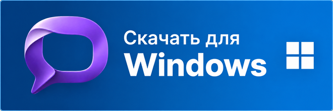</a>
  &nbsp;&nbsp;
  <a href="https://apps.microsoft.com/detail/9NZ0MQ87265F">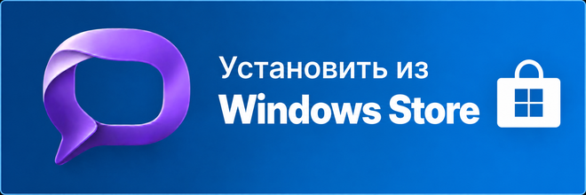</a>
  &nbsp;&nbsp;
  <a href="https://github.com/poznik/elseconf-pub/releases/download/v6.9.119/ElseConf-6.9.119.dmg">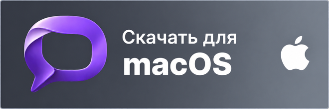</a>
   
  Windows — версия 6.9.119 · macOS — версия 6.9.119

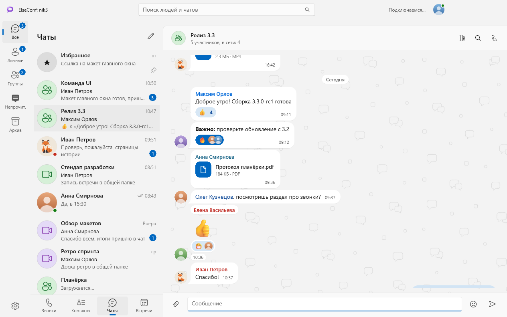

## Что умеет

### Чаты

- Личная переписка и группы, «Избранное» для заметок себе.
- Ответы с цитатой, пересылка, правка и удаление сообщений, упоминания, реакции и эмодзи.
- Файлы и картинки в обе стороны, просмотр картинок поверх окна, медиа и файлы беседы списком.
- Папки «Личные», «Группы», «Непрочитанные», «Архив» и свои папки; закрепление бесед, «отметить
  непрочитанной», «отметить всё прочитанным».
- Отметки доставки и прочтения, «печатает…», поиск людей и чатов.
- Группы: создание, участники и роли, права, картинка и название, передача владения, очистка и
  удаление.

### Звонки

- Звонки один на один: входящие и исходящие, журнал звонков, пропущенные с уведомлением.
- В окне звонка — камера, показ экрана и чат с собеседником.
- К разговору можно добавить людей — звонок продолжится конференцией.
- Звонок, принятый на другом вашем устройстве, не остаётся пропущенным.

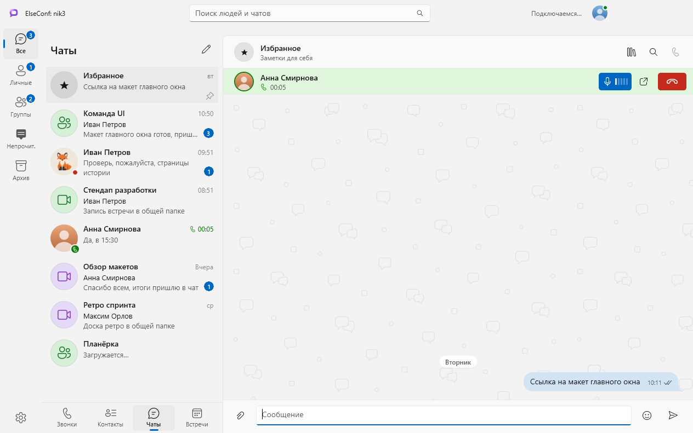

### Встречи

- Вход по ссылке из приглашения или по номеру — и на своём сервере, и гостем на чужом.
- «Сегодня в календаре»: встречи из Outlook с кнопкой «Войти», а когда встреча началась без вас —
  окно с «Подключиться».
- Окно встречи: видео участников, своя камера и показ экрана, список участников, чат встречи,
  плашка «Говорит», мини-окно поверх остальных окон.
- Свои встречи: создать сейчас, по расписанию или постоянной комнатой, изменить, начать, удалить.
- Запись встречи — на сервере или на свой компьютер, с согласием участников; раздел «Записи».
- История встреч по дням с карточкой: организатор, участники, чат.

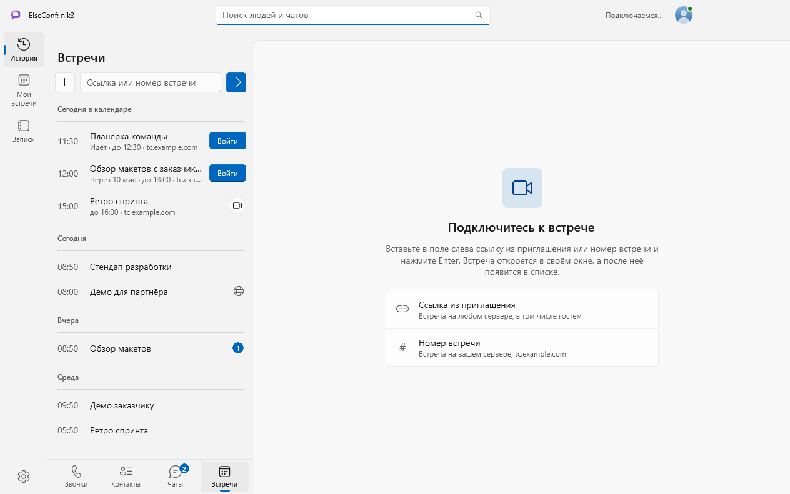

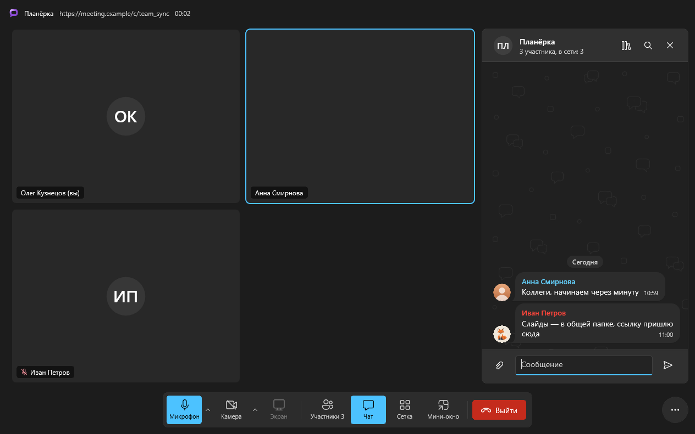

### Контакты

- «Мои контакты», все люди сервера и структура компании по подразделениям.
- Карточка человека: должность, отдел, почта, телефон, звонки с ним, кнопки «Написать» и
  «Позвонить».
- Статусы людей и свой статус: «в сети», «нет на месте», «не беспокоить» и свой текст — например,
  «в отпуске до 6 октября».

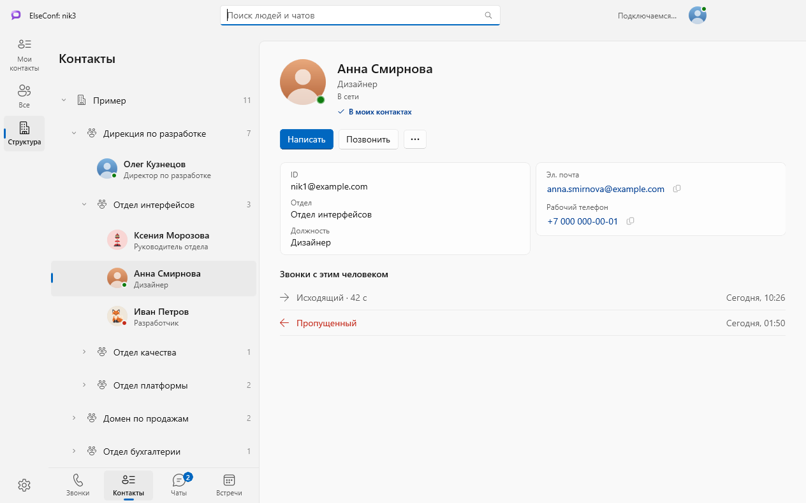

### Вход и оформление

- Вход паролем или через SSO; со второго запуска пароль не нужен.
- Несколько сохранённых подключений — к разным серверам и учётным записям.
- С сервером — только HTTPS.
- Светлая и тёмная темы, фоны бесед.

## Платформы

| Платформа | Состояние | Требования |
|---|---|---|
| Windows | Установщик — в [Releases](https://github.com/poznik/elseconf-pub/releases) или [Microsoft Store](https://apps.microsoft.com/detail/9NZ0MQ87265F) | Windows 10 20H1 и новее, x64 |
| macOS | Образ установки — в [Releases](https://github.com/poznik/elseconf-pub/releases) | macOS 15 и новее, Apple Silicon |
| Linux | Пакет `.deb` — в [Releases](https://github.com/poznik/elseconf-pub/releases), установка: `sudo apt install ./elseconf_6.9.24_amd64.deb` | Ubuntu Desktop 22.04 и 24.04, x86-64 |
| iPhone | В разработке, готовых сборок здесь пока нет | iOS 26 и новее |
| Android | В разработке, готовых сборок здесь пока нет | Android 10 и новее |

Набор возможностей у клиентов различается: полнее всего — клиент Windows, по нему и составлен
список выше.

### macOS

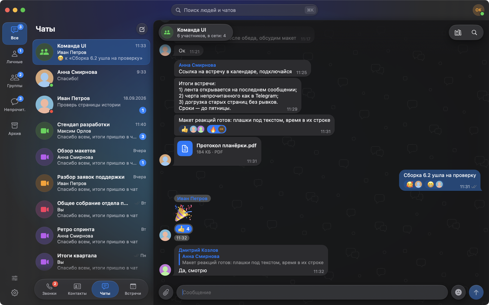

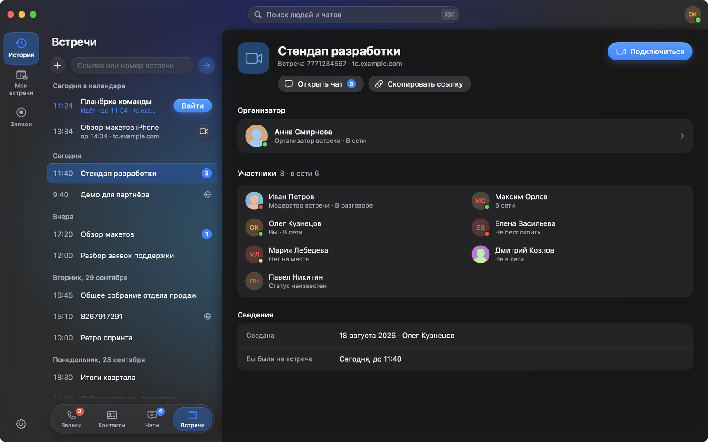

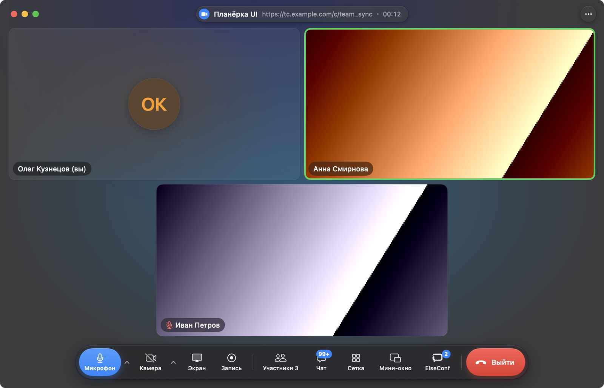

### iPhone

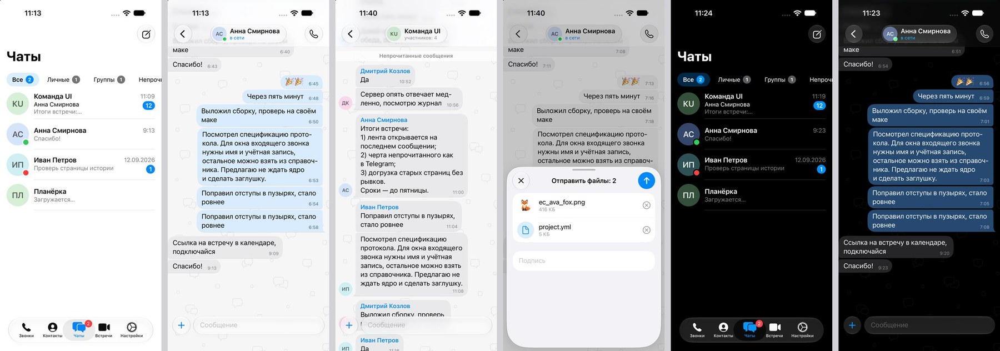

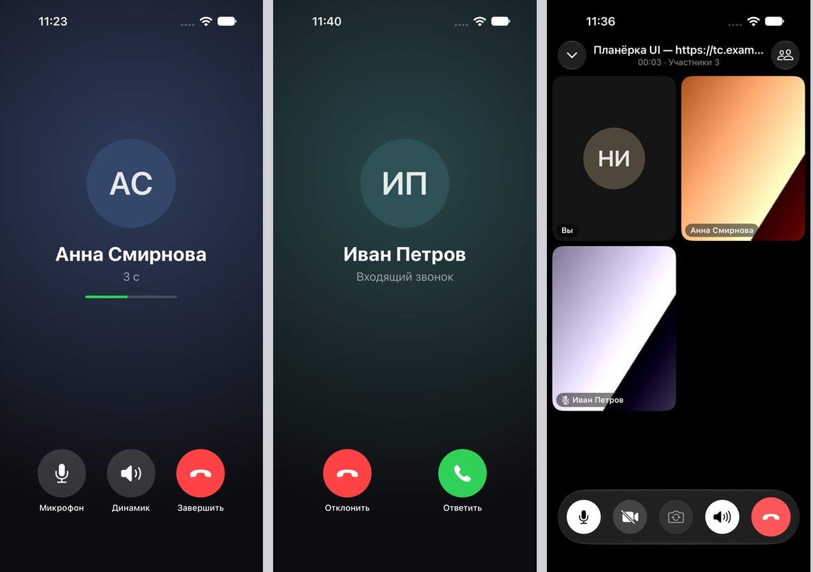

## Установка на Windows

1. Скачайте `ElseConf-<версия>-setup.exe` по ссылке вверху страницы или из
   [Releases](https://github.com/poznik/elseconf-pub/releases) и запустите.
2. Укажите адрес сервера, имя и пароль — или войдите через SSO.

- Права администратора не нужны: установщик ставит клиент в `%LOCALAPPDATA%\Programs\ElseConf`.
- Обновление — тот же установщик поверх прежней версии, данные остаются.
- Без WebView2 Runtime не откроются встречи по ссылке и вход через SSO.
- Тихая установка: `ElseConf-<версия>-setup.exe /VERYSILENT /SUPPRESSMSGBOXES`.

Установщик не запускается или установка прерывается — поставьте ElseConf
[из Microsoft Store](https://apps.microsoft.com/detail/9NZ0MQ87265F): нажмите «Установить». В поиске Store приложения нет, оно
открывается только по этой ссылке.

Что делает каждый параметр клиента — в [описании настроек](SETTINGS.md).

## Установка на macOS

1. Скачайте `ElseConf-<версия>.dmg` по ссылке вверху страницы или из
   [Releases](https://github.com/poznik/elseconf-pub/releases), откройте и перетащите ElseConf в папку «Программы».
2. Запустите ElseConf. Образ не нотаризован, поэтому первый запуск macOS остановит: откройте
   «Системные настройки» → «Конфиденциальность и безопасность» и нажмите «Всё равно открыть».
3. Укажите адрес сервера, имя и пароль — или войдите через SSO.

- Обновление — перетащить новую версию поверх прежней, данные остаются.

## Лицензия

ElseConf распространяется по лицензии [Apache-2.0](LICENSE). Сторонние компоненты в составе сборок
идут под своими лицензиями.

Какие данные клиент передаёт и хранит — в [политике конфиденциальности](PRIVACY.md).

---

Люди, переписка и встречи на снимках выдуманы.
