# Настройки ElseConf для Windows

Что делает каждый параметр клиента и как он меняет поведение. Описание — по версии 6.8.2.

- Настройки открывает шестерёнка внизу слева или `Ctrl+,`.
- Разделов пять: [Учётная запись](#учётная-запись), [Уведомления](#уведомления),
  [Звонки и устройства](#звонки-и-устройства), [Общие](#общие), [Горячие клавиши](#горячие-клавиши).
- Строка «Найти параметр» над списком разделов ищет по названиям и пояснениям в открытом разделе.
- Перемена действует сразу. Исключения помечены словами «со следующего входа».

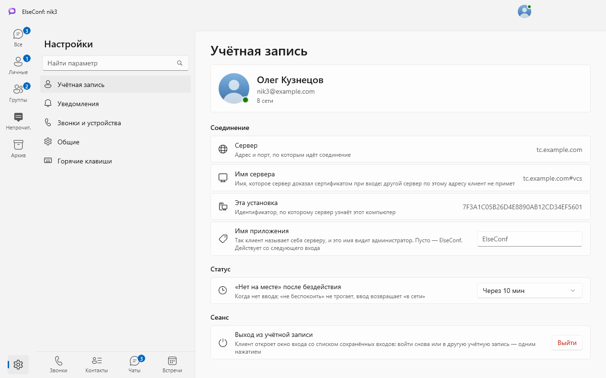

## Учётная запись

Сверху — карточка с вашим именем, учётной записью и статусом.

### Соединение

| Параметр | По умолчанию | Что делает |
|---|---|---|
| Сервер | — | Показывает адрес и порт, по которым идёт соединение. Не меняется. |
| Имя сервера | — | Показывает имя, которое сервер доказал сертификатом при входе. Другой сервер по тому же адресу клиент не примет. |
| Эта установка | — | Показывает идентификатор, по которому сервер узнаёт этот компьютер. Пригодится администратору, чтобы найти ваше подключение. |
| Имя приложения | Пусто — «ElseConf» | Так клиент называет себя серверу, и это имя видит администратор. Действует со следующего входа. |

### Статус

| Параметр | По умолчанию | Что делает |
|---|---|---|
| «Нет на месте» после бездействия | Через 10 мин | Когда столько времени нет ввода, клиент сам ставит статус «нет на месте». Первый ввод возвращает «в сети». Статус «не беспокоить» клиент не трогает. Варианты: «Не ставить», 5, 10, 15, 30 минут. |

### Сеанс

| Параметр | Что делает |
|---|---|
| Выход из учётной записи | Кнопка «Выйти» закрывает сеанс и открывает окно входа. Сохранённый вход остаётся в списке: войти снова или в другую учётную запись — одним нажатием. Переписка остаётся на сервере. |

## Уведомления

### Сообщения

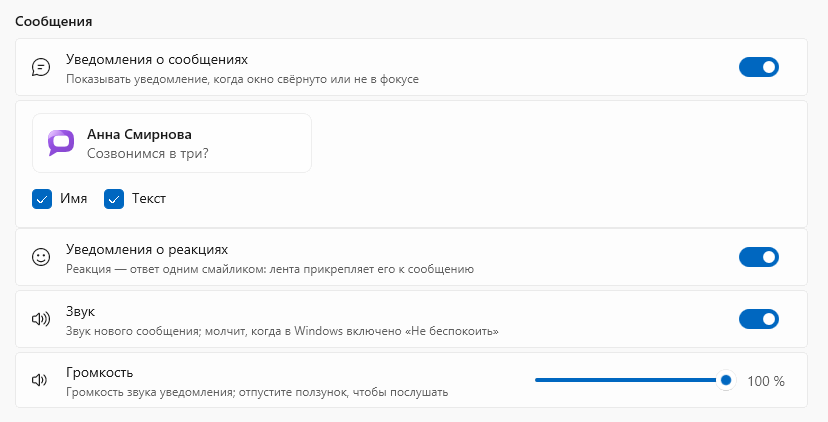

| Параметр | По умолчанию | Что делает |
|---|---|---|
| Уведомления о сообщениях | Включено | Показывает уведомление Windows о новом сообщении, когда окно клиента свёрнуто или не в фокусе. Выключено — уведомлений о сообщениях нет. |
| Образец уведомления: «Имя» | Включено | В уведомлении видно, от кого сообщение. Без флажка заголовок уведомления — «elseconf». |
| Образец уведомления: «Текст» | Включено | В уведомлении видно начало сообщения. Без флажка текст скрыт — удобно, когда экран видят другие люди. |
| Уведомления о реакциях | Включено | Уведомляет, когда на сообщение ответили реакцией — одним смайликом. Выключено — о реакциях клиент молчит. |
| Звук | Включено | Звук нового сообщения. Молчит, когда в Windows включено «Не беспокоить». |
| Громкость | 100 % | Громкость звука уведомления. Отпустите ползунок, чтобы послушать. Недоступна, когда звук выключен. |

### Уведомления из чатов

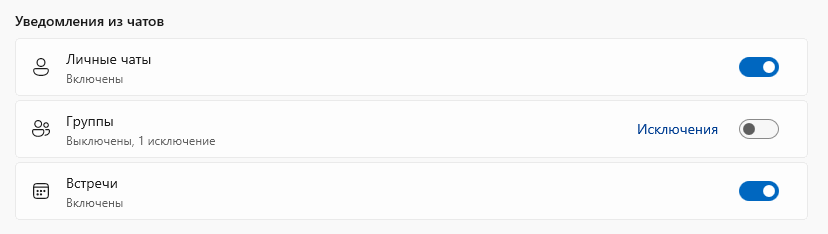

На снимке группы выключены, и у одной беседы — исключение.

| Параметр | По умолчанию | Что делает |
|---|---|---|
| Личные чаты | Включено | Уведомлять ли о сообщениях в личной переписке. |
| Группы | Включено | Уведомлять ли о сообщениях в группах. |
| Встречи | Включено | Уведомлять ли о сообщениях в чатах встреч. |
| Исключения | — | Ссылка появляется, когда у вида есть беседы, которые уведомляют иначе, чем он сам. Открывает их список; «Убрать» возвращает беседу к правилу вида. |

- Беседы выключенного вида выглядят в списке тихими: число непрочитанного у них серое. Число на
  значке клиента их не считает.
- Исключение создаёт пункт «Включить уведомления» в меню беседы: в выключенном виде эта беседа
  продолжит уведомлять.

### Счётчик непрочитанных и Windows

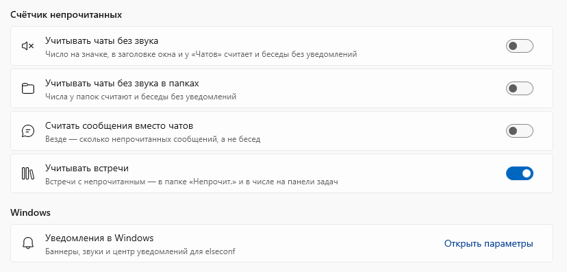

| Параметр | По умолчанию | Что делает |
|---|---|---|
| Учитывать чаты без звука | Выключено | Число на значке, в заголовке окна и у раздела «Чаты» считает и беседы без уведомлений. |
| Учитывать чаты без звука в папках | Выключено | Числа у папок считают и беседы без уведомлений. |
| Считать сообщения вместо чатов | Выключено | Везде показывается число непрочитанных сообщений, а не бесед. |
| Учитывать встречи | Включено | Встречи с непрочитанным попадают в папку «Непрочит.» и в число на панели задач. |
| Уведомления в Windows | — | Открывает параметры Windows: баннеры, звуки и центр уведомлений для клиента. |

## Звонки и устройства

### Устройства

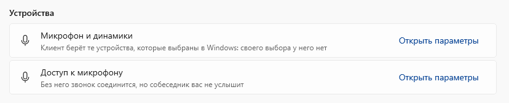

| Параметр | Что делает |
|---|---|
| Микрофон и динамики | Открывает параметры звука Windows. Своего выбора устройств для звонков у клиента нет: он берёт те, что выбраны в Windows. |
| Доступ к микрофону | Открывает параметры конфиденциальности Windows. Без доступа звонок соединится, но собеседник вас не услышит. |

### Окно звонка

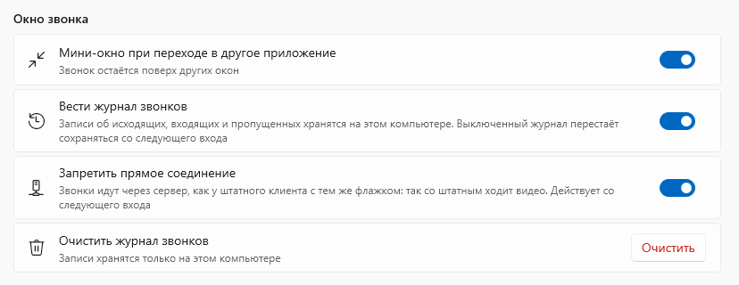

| Параметр | По умолчанию | Что делает |
|---|---|---|
| Мини-окно при переходе в другое приложение | Включено | Вы уходите в другую программу — звонок сворачивается в мини-окно поверх остальных окон. |
| Вести журнал звонков | Включено | Записи об исходящих, входящих и пропущенных звонках хранятся на этом компьютере. Выключенный журнал перестаёт сохраняться со следующего входа. |
| Запретить прямое соединение | Включено | Звонки идут через сервер, а не напрямую между устройствами. Со штатным клиентом платформы видео в звонке работает только так. Действует со следующего входа. |
| Очистить журнал звонков | — | Стирает записи журнала. Они хранятся только на этом компьютере, вернуть их нельзя. |

### Встречи

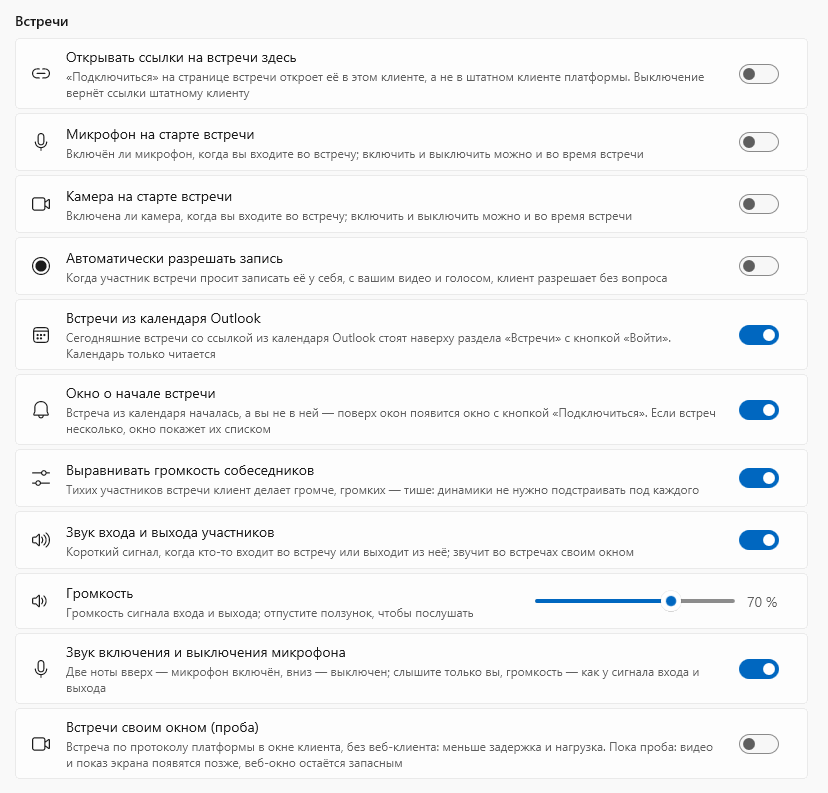

| Параметр | По умолчанию | Что делает |
|---|---|---|
| Открывать ссылки на встречи здесь | Выключено | Кнопка «Подключиться» на странице встречи открывает её в ElseConf, а не в штатном клиенте платформы. Если штатный клиент снова заберёт ссылки себе, ElseConf вернёт их при запуске. Выключение отдаёт ссылки штатному клиенту. |
| Микрофон на старте встречи | Выключено | С каким микрофоном вы входите во встречу: включённым или выключенным. Переключить можно и во время встречи. |
| Камера на старте встречи | Выключено | То же для камеры. |
| Автоматически разрешать запись | Выключено | Участник просит записать встречу у себя, с вашим видео и голосом, — клиент разрешает без вопроса. Выключено — на каждую просьбу в окне встречи появляется вопрос. |
| Встречи из календаря Outlook | Включено | Сегодняшние встречи со ссылкой из календаря Outlook стоят наверху раздела «Встречи» с кнопкой «Войти». Календарь клиент только читает. |
| Окно о начале встречи | Включено | Встреча из календаря началась, а вас в ней нет — поверх окон появляется окно с кнопкой «Подключиться». Несколько встреч окно показывает списком. Недоступно без встреч из календаря Outlook. |
| Выравнивать громкость собеседников | Включено | Тихих участников клиент делает громче, громких — тише: динамики не нужно подстраивать под каждого. |
| Звук входа и выхода участников | Включено | Короткий сигнал, когда кто-то входит во встречу или выходит из неё. |
| Громкость | 70 % | Громкость сигнала входа и выхода. Отпустите ползунок, чтобы послушать. |
| Звук включения и выключения микрофона | Включено | Две ноты вверх — микрофон включён, вниз — выключен. Слышите только вы. Громкость — как у сигнала входа и выхода. |
| Встречи своим окном (проба) | Выключено | Встреча своего сервера открывается в собственном окне клиента по протоколу платформы, без веб-клиента: меньше задержка и нагрузка. Выключено — встреча открывается в веб-окне. |

Микрофон и камера на старте, разрешение записи, выравнивание громкости и звук входа и выхода
относятся к встрече в собственном окне клиента. В веб-окне этим управляет страница сервера.

## Общие

### Внешний вид

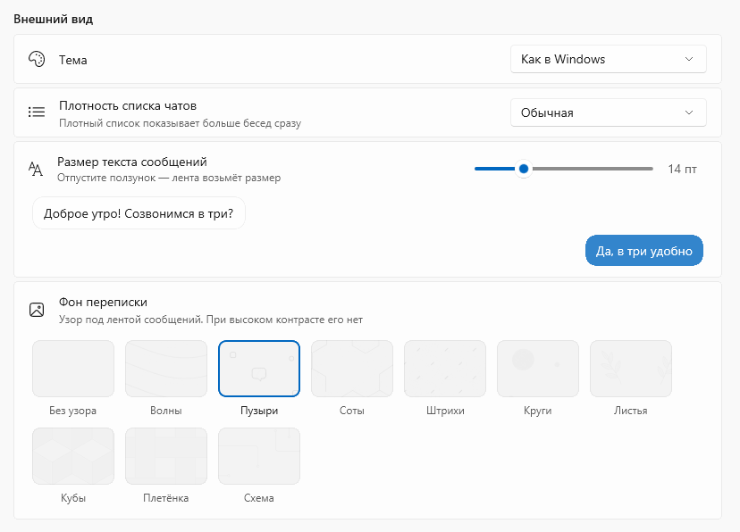

| Параметр | По умолчанию | Что делает |
|---|---|---|
| Тема | Как в Windows | Светлая или тёмная тема окон клиента. «Как в Windows» следует за темой системы. |
| Плотность списка чатов | Обычная | «Плотная» показывает больше бесед сразу. |
| Размер текста сообщений | 14 пт | Размер текста в ленте, от 12 до 20 пт. Образец под ползунком показывает результат; лента берёт размер, когда вы отпускаете ползунок. |
| Фон переписки | Пузыри | Узор под лентой сообщений: девять узоров или «Без узора». При высоком контрасте Windows узора нет. |

### Запуск, файлы, язык

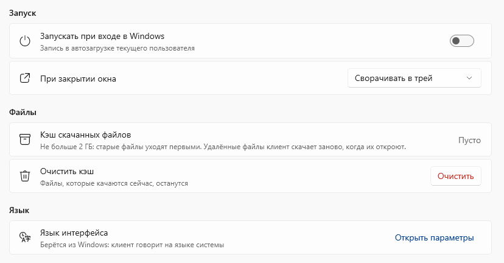

| Параметр | По умолчанию | Что делает |
|---|---|---|
| Запускать при входе в Windows | Выключено | Клиент стартует вместе с Windows — записью в автозагрузке текущего пользователя. |
| При закрытии окна | Сворачивать в трей | «Сворачивать в трей» — клиент продолжает работать, сообщения и звонки приходят. «Выходить из приложения» — закрытие окна завершает клиент. |
| Кэш скачанных файлов | — | Показывает, сколько места заняли скачанные файлы. Кэш не больше 2 ГБ: старые файлы уходят первыми. Удалённый файл клиент скачает заново, когда его откроют. |
| Очистить кэш | — | Удаляет скачанные файлы. Файлы, которые качаются сейчас, остаются. |
| Язык интерфейса | Язык Windows | Клиент говорит на языке системы. Ссылка открывает языковые параметры Windows. |

### О программе

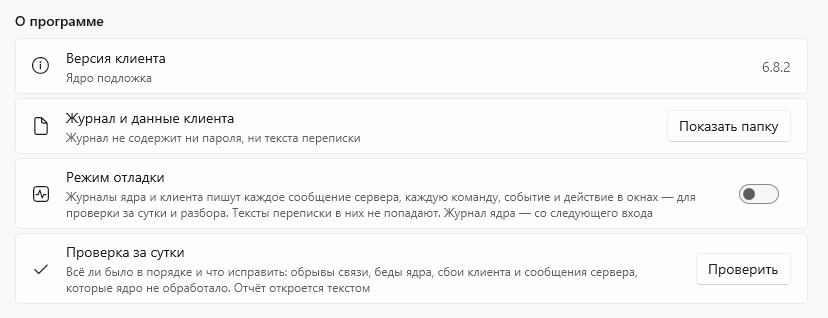

| Параметр | По умолчанию | Что делает |
|---|---|---|
| Версия клиента | — | Показывает версию клиента и, строкой ниже, версию ядра. Назовите её, когда сообщаете о неполадке. |
| Журнал и данные клиента | — | «Показать папку» открывает папку с журналом и данными клиента. В журнале нет ни пароля, ни текста переписки. |
| Режим отладки | Выключено | Журналы ядра и клиента пишут каждое сообщение сервера, каждую команду, событие и действие в окнах. Тексты переписки в них не попадают. Журнал ядра — со следующего входа. Включайте, когда нужно разобрать неполадку. |
| Проверка за сутки | — | «Проверить» собирает отчёт за сутки: обрывы связи, ошибки ядра, сбои клиента и сообщения сервера, которые ядро не обработало. Отчёт открывается текстом. |

## Горячие клавиши

### Звонки и встречи — во всей Windows

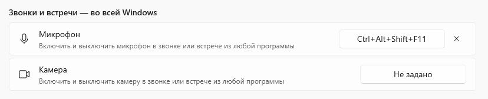

Эти два сочетания работают из любой программы, пока идёт звонок или встреча. По умолчанию они не
заданы. На снимке микрофону задано `Ctrl+Alt+Shift+F11`.

| Параметр | По умолчанию | Что делает |
|---|---|---|
| Микрофон | Не задано | Включает и выключает микрофон в звонке или встрече. |
| Камера | Не задано | Включает и выключает камеру в звонке или встрече. |

Как задать сочетание:

1. Нажмите кнопку справа от названия — на ней появится «Нажмите сочетание…».
2. Нажмите сочетание. `Esc` отменяет выбор.
3. Чтобы снять сочетание, нажмите крестик рядом с кнопкой.

- Годится сочетание с `Ctrl`, `Alt` или `Win`. Клавишам `F1`–`F24` хватает `Shift`, а `F13`–`F24`
  годятся и одни.
- Сочетание самого клиента или занятое другой программой не берётся: причина появится красной
  строкой.
- После нажатия внизу экрана на полторы секунды появляется плашка — например, «Микрофон выключен».
- Вне звонка и встречи сочетания свободны для других программ.

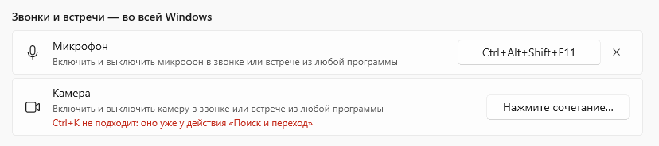

### Окно

Эти сочетания постоянные, раздел их только показывает.

| Сочетание | Действие |
|---|---|
| `Ctrl+K` | Поиск и переход |
| `Ctrl+N` | Новый чат |
| `Ctrl+Shift+N` | Новая группа |
| `Ctrl+J` | Контакты |
| `Ctrl+0` | «Избранное» |
| `Ctrl+,` | Настройки |
| `Ctrl+1…9` | Папка чатов по номеру |
| `Ctrl+Shift+↑` `↓` | Соседняя папка |
| `Ctrl+PgUp` `PgDn`, `Alt+↑` `↓` | Соседняя беседа в показанном списке |
| `Ctrl+Alt+Home` `End` | Первая и последняя беседа |
| `F5` | Перечитать с сервера — на случай, когда что-то разошлось |
| `Esc`, `Ctrl+W` | Свернуть в трей; сеанс и звонки продолжают работать |

### Беседа

| Сочетание | Действие |
|---|---|
| `Enter` | Отправить сообщение |
| `Shift+Enter` | Новая строка |
| `Ctrl+↑` `↓` | Ответить на сообщение: вверх — старше, вниз — новее; ниже последнего ответ снимается |
| `↑` | Править последнее своё сообщение, когда черновик пуст |
| `Esc` | Отказаться от правки |
| `Ctrl+R` | Отметить беседу прочитанной |
| `Ctrl+F` | Поиск в беседе: `Enter` — найденное раньше, `Shift+Enter` — позже, `Esc` — закрыть |
| `←` `→` | Соседняя картинка в просмотре; `Ctrl+C` — скопировать, `Ctrl+S` — сохранить, колесо — приблизить |

---

Снимки сделаны в демонстрационном режиме клиента: люди, адреса и переписка выдуманы, а вместо версии
ядра стоит «подложка».
